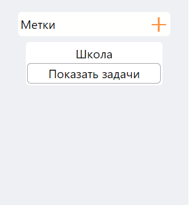
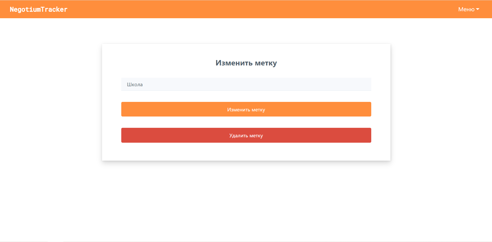
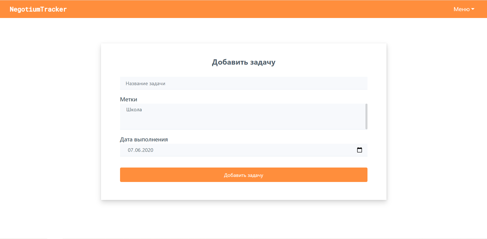
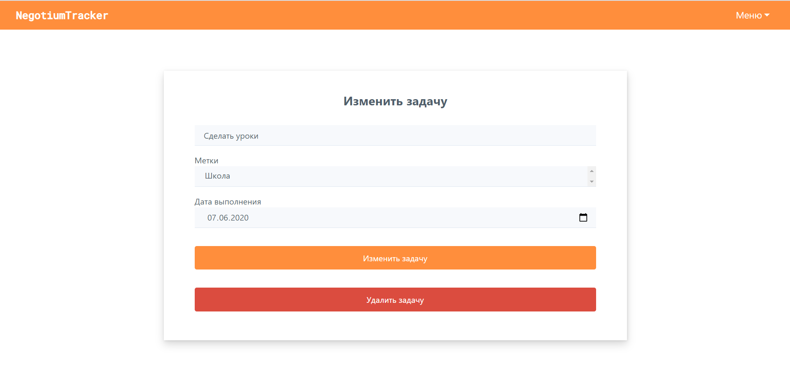
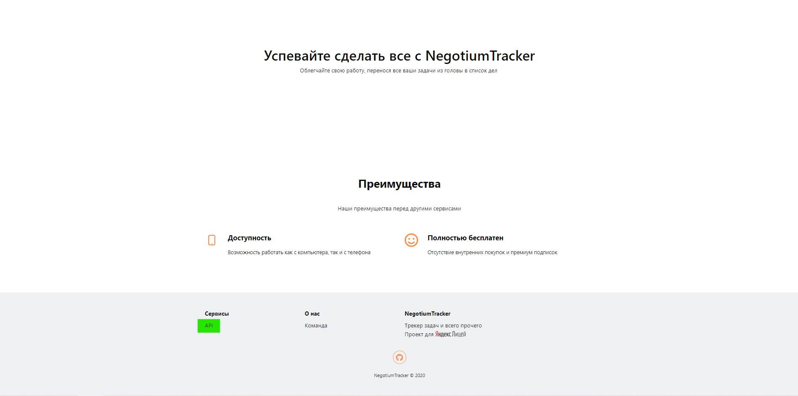

# NegotiumTracker

### Установка и запуск

1. Для начала нужно пройти по этой [ссылке](https://myaccount.google.com/lesssecureapps) и разрешить небезопасные приложения. **После того, как вы протестируете и оцените приложение, запретите небезопасные приложения в аккаунте google.**
2. Далее в файлике `.env`, нужно установить логин и пароль от google аккаунта
3. После этого нужно установить необходимые библиотеки (`pip install -r requirements.txt`) и запустить `app.py`
4. Также работающий сайт можно посмотреть по этой ссылке: https://negotiumtracker.herokuapp.com

### Описание проекта

Данный проект представляет собой планировщик задач в виде web страницы. У сайта есть две главные страницы 

- Первая страница, расположенная по адресу https://negotuimtracker.herokuapp.com/

- А также страница, где происходит работа с задачами https://negotiumtracker.herokuapp.com/main_app/

*(Все ссылки указывают на heroku, но они действительны и для localhost)*

На странице https://negotiumtracker.herokuapp.com/main_app/all можно увидеть следующее (боковое меню сначала нужно открыть):

#### Работа с метками

При нажатии на метки, откроется меню, с существующими метками:

При нажатии на имя метки откроется страница её редактирования:

Думаю, по названиям кнопок понятно, что они делают.

При нажатии на плюсик, расположенный рядом со словом “метка”, открывается страница создания метки. Её интерфейс настолько прост и понятен, что скриншота не будет ¯\\\_(ツ)_/¯.

#### Работа с задачами

После нажатия на кнопку создания новой задачи (где она находится, можно увидеть на скриншоте выше), открывается следующая страница: 

Здесь все максимально просто:

- Пишешь название задачи

- Выбираешь (или нет) существующие метки

- Выбираешь дату, к которой нужно выполнить задачу

- Нажимаешь на кнопку “Добавить задачу”

- Готово! \^o^/

Важное дополнение - у задачи не может быть дата выполнения в прошлом.

После добавления задачи она появится на главной странице (/app/all)

Справа от названия задачи можно увидеть карандашик. Нажав на него, откроется меню редактирования задачи: 

Можно либо изменить задачу (изменив какие-то параметры), либо удалить её.

При нажатии на кнопку **Ваш API ключ **откроется страница, на которой будет написан ваш API ключ. Если почта от аккаунта не подтверждена, то вы увидите следующее: 

Если же вы подтвердили почту, то вы увидите API ключ. 

На этом вступительный лонгрид закончен! \^o^/ 

### Незначительные моменты

При регистрации в сервисе нужно будет указать вашу реальную почту, иначе вы не сможете подтвердить её и следовательно, пользоваться `API` приложения.

*У сайта есть мобильная версия.* 

Все информация, о том, как использовать `API` приложения можно узнать здесь: 
